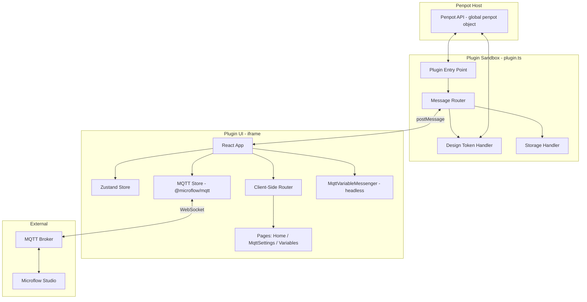
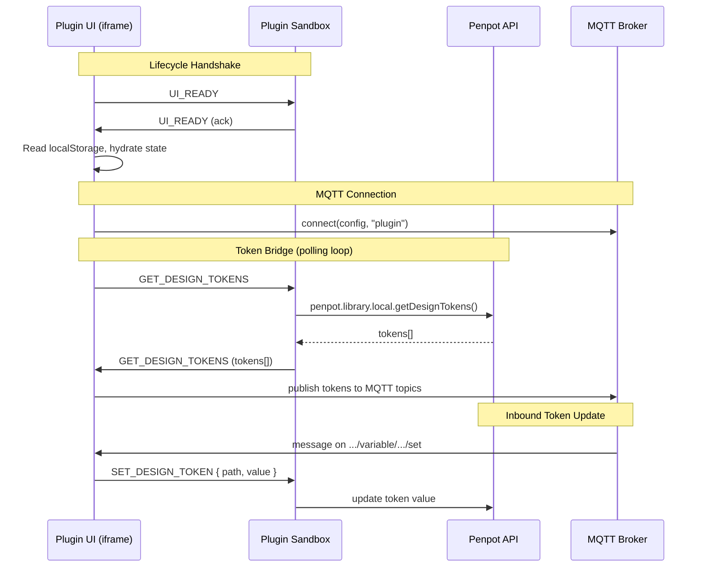

# Design Document: Penpot Plugin

## Overview

The Penpot Plugin is a Microflow Hardware Bridge (MHB) plugin for Penpot that mirrors the existing Figma plugin's functionality. It enables designers to bridge Penpot design tokens to hardware prototypes via MQTT. The plugin follows Penpot's plugin architecture: a plugin sandbox script (`plugin.ts`) with access to the `penpot` global object, and a UI iframe built with React + Vite + Tailwind CSS + Zustand.

The plugin reuses the shared `@microflow/mqtt` workspace package for all MQTT operations and lives at `apps/penpot-plugin` in the monorepo.

### Key Differences from Figma Plugin

| Aspect | Figma Plugin | Penpot Plugin |
|---|---|---|
| UI Framework | Preact + `@create-figma-plugin/ui` | React + Tailwind CSS |
| Build Tool | `build-figma-plugin` (Webpack) | Vite (dual entry: plugin + UI) |
| Sandbox API | `figma` global | `penpot` global |
| Storage | `figma.clientStorage` (async KV) | `localStorage` (via `allow:localstorage` permission) |
| Variables | Figma Variables API (collections, modes) | Penpot Design Tokens API (groups, sets) |
| Messaging | `figma.ui.postMessage` / `parent.postMessage` | `penpot.ui.sendMessage` / `parent.postMessage` |
| Panel Management | `showUI({ width, height })` | `penpot.ui.open(name, url, { width, height })` |
| Theme Detection | `prefers-color-scheme` media query | `penpot.theme` property + `themechange` event |
| Manifest | `manifest.json` (Figma format) | `manifest.json` (Penpot format with permissions array) |

## Architecture



### Build Architecture

The Penpot plugin uses Vite with two separate build entries:

1. **Plugin entry** (`src/plugin/plugin.ts`): Built as an IIFE bundle targeting the Penpot sandbox. No DOM access. Outputs to `dist/plugin.js`.
2. **UI entry** (`src/ui/index.html`): Standard Vite React app. Outputs to `dist/ui/index.html` with associated assets.

The `manifest.json` references these output paths and is copied to `dist/` during build.

### Message Flow



## Components and Interfaces

### 1. Plugin Manifest (`manifest.json`)

```json
{
  "name": "Microflow hardware bridge",
  "description": "Bridge Penpot design tokens to hardware prototypes via MQTT",
  "host": "https://your-hosted-url.com",
  "code": "plugin.js",
  "icon": "icon.png",
  "permissions": [
    "content:read",
    "content:write",
    "allow:localstorage"
  ]
}
```

### 2. Message Types (`src/common/messages.ts`)

Mirrors the Figma plugin's discriminated union pattern, adapted for Penpot:

```typescript
export const MSG = {
  // Lifecycle
  UI_READY: "UI_READY",
  // Storage (localStorage in Penpot)
  GET_LOCAL_STATE: "GET_LOCAL_STATE",
  SET_LOCAL_STATE: "SET_LOCAL_STATE",
  // UI
  SHOW_TOAST: "SHOW_TOAST",
  OPEN_LINK: "OPEN_LINK",
  // Design Tokens
  GET_DESIGN_TOKENS: "GET_DESIGN_TOKENS",
  SET_DESIGN_TOKEN: "SET_DESIGN_TOKEN",
} as const;
```

Key differences from Figma:
- No `SET_UI_OPTIONS` — Penpot panel size is set at `penpot.ui.open()` time and cannot be dynamically resized.
- No `DELETE_VARIABLE` — token deletion is not needed for the bridge use case.
- `GET_LOCAL_VARIABLES` → `GET_DESIGN_TOKENS` — renamed to match Penpot terminology.
- `SET_LOCAL_VARIABLE` → `SET_DESIGN_TOKEN` — renamed to match Penpot terminology.

### 3. Plugin Sandbox (`src/plugin/plugin.ts`)

```typescript
// Entry point — executed by Penpot when plugin loads
penpot.ui.open("Microflow hardware bridge", `${url}`, {
  width: 275,
  height: 190,
});

penpot.ui.onMessage<Message>(handler);
penpot.on("themechange", (theme) => sendToUI({ type: MSG.THEME_CHANGE, payload: theme }));
```

The sandbox uses `penpot.ui.sendMessage()` to send messages to the UI and `penpot.ui.onMessage()` to receive them.

### 4. Design Token Handler (`src/plugin/handlers/design-tokens.ts`)

Reads design tokens from the Penpot file using the library API. Penpot design tokens are organized in a hierarchical structure with groups and sets. The handler flattens these into a list of bridgeable tokens.

```typescript
export function getDesignTokens(): DesignToken[] {
  // Access local library design tokens
  // Flatten token hierarchy into a list
  // Map to DesignToken interface with id, name, type, value
}

export function setDesignToken(path: string, value: unknown): boolean {
  // Find token by path
  // Validate and convert value to correct type
  // Update token value via Penpot API
}
```

### 5. UI Application (`src/ui/`)

Standard React app structure:

- **`index.html`** — Vite entry point
- **`main.tsx`** — React root with providers
- **`App.tsx`** — Top-level component with handshake, theme sync, MQTT connection, router
- **`stores/app.ts`** — Zustand store (same shape as Figma plugin)
- **`hooks/`** — `useMessageListener`, `useNavigation`, `useCopyToClipboard` (adapted from Figma plugin, using React instead of Preact)
- **`pages/`** — `Home`, `MqttSettings`, `Variables`
- **`components/`** — `PageLayout`, `MqttVariableMessenger`

### 6. MQTT Variable Messenger (`src/ui/components/MqttVariableMessenger.ts`)

Headless component that bridges MQTT ↔ Penpot design tokens. Same logic as the Figma plugin's version:
- Polls the sandbox for token changes at 250ms intervals
- Publishes token list to `microflow/{uniqueId}/plugin/variables`
- Publishes individual token values to `microflow/{uniqueId}/plugin/variable/{tokenId}`
- Subscribes to `microflow/{uniqueId}/+/variable/+/set` for inbound updates
- Subscribes to `microflow/{uniqueId}/+/variables/request` for variable request responses
- Deduplicates publishes using a ref-based value cache

### 7. Token ID Helpers (`src/common/mqtt-topics.ts`)

Penpot tokens use path-based identifiers (e.g., `group/token-name`) rather than Figma's `VariableID:x:y` format. The helpers are adapted accordingly:

```typescript
// Penpot tokens use path-based IDs with slashes
// For MQTT topics, encode slashes as dashes
export const shortTokenId = (path: string) => path.replace(/\//g, "-");
export const fullTokenId = (short: string) => short.replace(/-/g, "/");
```

### 8. Storage Handler (`src/plugin/handlers/storage.ts`)

Unlike Figma's `clientStorage` (async KV store in the sandbox), Penpot grants `localStorage` access directly in the UI iframe via the `allow:localstorage` permission. This simplifies the architecture:

- **Figma**: UI → postMessage → sandbox → `figma.clientStorage.getAsync()` → postMessage → UI
- **Penpot**: UI → `localStorage.getItem()` directly

The storage handler in the sandbox is still used for the handshake pattern (responding to `GET_LOCAL_STATE` / `SET_LOCAL_STATE` messages), but the actual read/write happens in the UI via `localStorage`. This keeps the message protocol consistent with the Figma plugin while simplifying the implementation.

## Data Models

### DesignToken

```typescript
/** Represents a single bridgeable design token from Penpot */
export type DesignToken = {
  /** Unique path-based identifier (e.g., "colors/primary") */
  path: string;
  /** Display name (leaf segment of path) */
  name: string;
  /** Token type */
  type: "boolean" | "string" | "number" | "color";
  /** Current resolved value */
  value: boolean | string | number | ColorValue;
};

export type ColorValue = {
  r: number;
  g: number;
  b: number;
  a: number;
};
```

### Message Types

```typescript
interface MessageMap {
  [MSG.UI_READY]: undefined;
  [MSG.GET_LOCAL_STATE]: { key: string; value?: unknown };
  [MSG.SET_LOCAL_STATE]: { key: string; value?: unknown };
  [MSG.SHOW_TOAST]: { message: string };
  [MSG.OPEN_LINK]: string;
  [MSG.GET_DESIGN_TOKENS]: DesignToken[] | undefined;
  [MSG.SET_DESIGN_TOKEN]: { path: string; value: unknown };
}
```

### AppState (Zustand Store)

```typescript
export type AppState = {
  pluginReady: boolean;
  setPluginReady: (ready: boolean) => void;
  mqttConfig: MqttConfig | null;
  setMqttConfig: (config: MqttConfig | null) => void;
  darkMode: boolean;
  setDarkMode: (dark: boolean) => void;
  setAppState: (partial: Partial<AppState>) => void;
};
```

### MqttConfig (from `@microflow/mqtt`)

```typescript
export type MqttConfig = {
  url: string;
  username?: string;
  password?: string;
  uniqueId: string;
};
```

### Penpot Manifest

```typescript
type PenpotManifest = {
  name: string;
  description: string;
  host: string;
  code: string;
  icon: string;
  permissions: Array<"content:read" | "content:write" | "allow:localstorage">;
};
```
