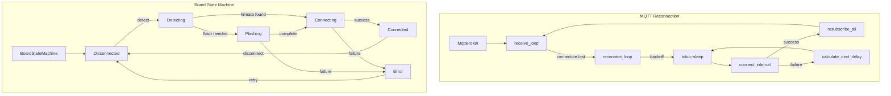
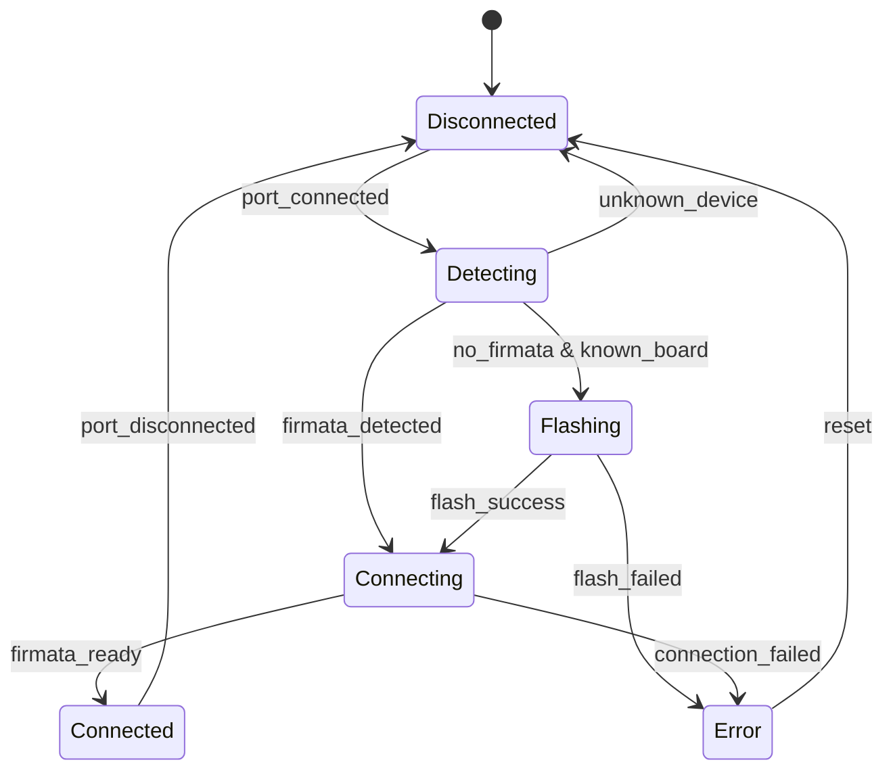

# Design Document: Rust Runtime Reliability (Phase 2)

## Overview

This design addresses three reliability improvements for the Tauri/Rust runtime in Microflow:

1. **MQTT Reconnection with Backoff** - Automatic reconnection when broker connection is lost, using exponential backoff to avoid overwhelming the broker
2. **Board Connection State Machine** - A proper state machine for board connection lifecycle with atomic transitions to prevent race conditions
3. **Integration Tests** - Comprehensive tests for component lifecycle, edge routing, and event propagation

These improvements build on the Phase 1 stability work and focus on making the runtime resilient to network and hardware failures.

## Architecture



### MQTT Reconnection Flow

```mermaid
sequenceDiagram
    participant App
    participant Broker as MqttBroker
    participant Loop as receive_loop
    participant Recon as reconnect_loop

    App->>Broker: connect()
    Broker->>Loop: spawn receive_loop
    
    Note over Loop: Connection lost
    Loop->>Broker: status = Disconnected
    Loop->>Recon: spawn reconnect_loop
    
    loop Backoff Retry
        Recon->>Recon: sleep(delay)
        Recon->>Broker: connect_internal()
        alt Success
            Broker-->>Recon: Ok
            Recon->>Broker: resubscribe_all()
            Recon->>Loop: spawn new receive_loop
        else Failure
            Broker-->>Recon: Err
            Recon->>Recon: delay *= multiplier
            Recon->>Recon: delay = min(delay, max_delay)
        end
    end
```

### Board State Machine Transitions



## Components and Interfaces

### 1. ReconnectConfig (`src/mqtt/broker.rs`)

Configuration for exponential backoff reconnection strategy.

```rust
use std::time::Duration;

/// Configuration for MQTT reconnection with exponential backoff
#[derive(Debug, Clone)]
pub struct ReconnectConfig {
    /// Initial delay before first reconnection attempt (default: 1s)
    pub initial_delay: Duration,
    /// Maximum delay between attempts (default: 60s)
    pub max_delay: Duration,
    /// Multiplier applied to delay after each failure (default: 2.0)
    pub multiplier: f64,
    /// Maximum number of attempts, None for infinite (default: None)
    pub max_attempts: Option<usize>,
}

impl Default for ReconnectConfig {
    fn default() -> Self {
        Self {
            initial_delay: Duration::from_secs(1),
            max_delay: Duration::from_secs(60),
            multiplier: 2.0,
            max_attempts: None,
        }
    }
}

impl ReconnectConfig {
    /// Calculate the next delay after a failed attempt
    pub fn next_delay(&self, current: Duration) -> Duration {
        let next_secs = current.as_secs_f64() * self.multiplier;
        let capped_secs = next_secs.min(self.max_delay.as_secs_f64());
        Duration::from_secs_f64(capped_secs)
    }
}
```

### 2. MqttBroker Reconnection (`src/mqtt/broker.rs`)

Extended MqttBroker with automatic reconnection support.

```rust
impl MqttBroker {
    /// Internal connect method for reconnection
    async fn connect_internal(&mut self) -> Result<(), String> {
        // Same logic as connect() but without spawning receive_loop
        // Returns after CONNACK received
    }

    /// Resubscribe to all previously subscribed topics
    async fn resubscribe_all(&self) -> Result<(), String> {
        let state = self.state.read().await;
        let topics: Vec<String> = state.subscriptions.keys().cloned().collect();
        drop(state);

        for topic in topics {
            // Resubscribe without callback (already stored)
            self.resubscribe_topic(&topic).await?;
        }
        Ok(())
    }

    /// Reconnection loop with exponential backoff
    async fn reconnect_loop(
        broker: Arc<RwLock<MqttBroker>>,
        config: ReconnectConfig,
        state: Arc<RwLock<BrokerState>>,
    ) {
        let mut delay = config.initial_delay;
        let mut attempts = 0;

        loop {
            // Check max attempts
            if let Some(max) = config.max_attempts {
                if attempts >= max {
                    log::error!(
                        "[MQTT] Max reconnection attempts ({}) reached, giving up",
                        max
                    );
                    break;
                }
            }

            log::info!(
                "[MQTT] Reconnecting in {:?} (attempt {})",
                delay,
                attempts + 1
            );
            tokio::time::sleep(delay).await;

            // Attempt reconnection
            let result = {
                let mut broker_guard = broker.write().await;
                broker_guard.connect_internal().await
            };

            match result {
                Ok(_) => {
                    log::info!("[MQTT] Reconnected successfully");
                    
                    // Resubscribe to all topics
                    let broker_guard = broker.read().await;
                    if let Err(e) = broker_guard.resubscribe_all().await {
                        log::warn!("[MQTT] Failed to resubscribe: {}", e);
                    }
                    
                    // Reset delay for next disconnect
                    // (handled by new receive_loop)
                    break;
                }
                Err(e) => {
                    log::warn!("[MQTT] Reconnection failed: {}", e);
                    attempts += 1;
                    delay = config.next_delay(delay);
                }
            }
        }
    }
}
```

### 3. BoardConnectionState (`src/hardware/state.rs`)

New module for board connection state machine.

```rust
use std::sync::atomic::{AtomicU8, Ordering};
use std::sync::RwLock;

/// Possible states for board connection lifecycle
#[derive(Debug, Clone, Copy, PartialEq, Eq)]
#[repr(u8)]
pub enum BoardConnectionState {
    /// No board connected
    Disconnected = 0,
    /// Scanning port for board type
    Detecting = 1,
    /// Flashing firmware to board
    Flashing = 2,
    /// Establishing Firmata connection
    Connecting = 3,
    /// Board connected and ready
    Connected = 4,
    /// Error occurred during connection
    Error = 5,
}

impl BoardConnectionState {
    /// Convert from u8, returns Disconnected for invalid values
    fn from_u8(value: u8) -> Self {
        match value {
            0 => Self::Disconnected,
            1 => Self::Detecting,
            2 => Self::Flashing,
            3 => Self::Connecting,
            4 => Self::Connected,
            5 => Self::Error,
            _ => Self::Disconnected,
        }
    }

    /// Get human-readable state name
    pub fn as_str(&self) -> &'static str {
        match self {
            Self::Disconnected => "disconnected",
            Self::Detecting => "detecting",
            Self::Flashing => "flashing",
            Self::Connecting => "connecting",
            Self::Connected => "connected",
            Self::Error => "error",
        }
    }
}

/// Thread-safe state machine for board connection lifecycle
pub struct BoardStateMachine {
    /// Current state stored as atomic u8
    state: AtomicU8,
    /// Last error message for debugging
    last_error: RwLock<Option<String>>,
}

impl BoardStateMachine {
    pub fn new() -> Self {
        Self {
            state: AtomicU8::new(BoardConnectionState::Disconnected as u8),
            last_error: RwLock::new(None),
        }
    }

    /// Get current state
    pub fn current(&self) -> BoardConnectionState {
        BoardConnectionState::from_u8(self.state.load(Ordering::SeqCst))
    }

    /// Attempt atomic state transition
    /// Returns true if transition succeeded, false if current state didn't match `from`
    pub fn transition(
        &self,
        from: BoardConnectionState,
        to: BoardConnectionState,
    ) -> bool {
        self.state
            .compare_exchange(
                from as u8,
                to as u8,
                Ordering::SeqCst,
                Ordering::SeqCst,
            )
            .is_ok()
    }

    /// Set error state with message
    pub fn set_error(&self, message: String) {
        if let Ok(mut guard) = self.last_error.write() {
            *guard = Some(message);
        }
        // Force transition to Error state
        self.state.store(BoardConnectionState::Error as u8, Ordering::SeqCst);
    }

    /// Get last error message
    pub fn get_last_error(&self) -> Option<String> {
        self.last_error.read().ok().and_then(|g| g.clone())
    }

    /// Clear error and reset to Disconnected
    pub fn reset(&self) {
        if let Ok(mut guard) = self.last_error.write() {
            *guard = None;
        }
        self.state.store(BoardConnectionState::Disconnected as u8, Ordering::SeqCst);
    }
}

impl Default for BoardStateMachine {
    fn default() -> Self {
        Self::new()
    }
}
```

### 4. Integration Test Infrastructure (`tests/common/mod.rs`)

Shared test utilities and mock implementations.

```rust
use std::sync::Arc;
use std::collections::HashMap;

/// Mock board handle for testing components without hardware
pub struct MockBoardHandle {
    pin_values: std::sync::RwLock<HashMap<u8, u16>>,
    connected: std::sync::atomic::AtomicBool,
}

impl MockBoardHandle {
    pub fn new() -> Self {
        Self {
            pin_values: std::sync::RwLock::new(HashMap::new()),
            connected: std::sync::atomic::AtomicBool::new(true),
        }
    }

    pub fn set_pin(&self, pin: u8, value: u16) {
        if let Ok(mut guard) = self.pin_values.write() {
            guard.insert(pin, value);
        }
    }

    pub fn get_pin(&self, pin: u8) -> Option<u16> {
        self.pin_values.read().ok().and_then(|g| g.get(&pin).copied())
    }

    pub fn is_connected(&self) -> bool {
        self.connected.load(std::sync::atomic::Ordering::SeqCst)
    }

    pub fn disconnect(&self) {
        self.connected.store(false, std::sync::atomic::Ordering::SeqCst);
    }
}

/// Mock component for testing event routing
pub struct MockComponent {
    pub id: String,
    pub received_events: std::sync::RwLock<Vec<ComponentEvent>>,
    pub current_value: std::sync::RwLock<Option<ComponentValue>>,
}

impl MockComponent {
    pub fn new(id: &str) -> Self {
        Self {
            id: id.to_string(),
            received_events: std::sync::RwLock::new(Vec::new()),
            current_value: std::sync::RwLock::new(None),
        }
    }

    pub fn receive_event(&self, event: ComponentEvent) {
        if let Ok(mut guard) = self.received_events.write() {
            guard.push(event.clone());
        }
        if let Ok(mut guard) = self.current_value.write() {
            *guard = Some(event.value);
        }
    }

    pub fn event_count(&self) -> usize {
        self.received_events.read().map(|g| g.len()).unwrap_or(0)
    }

    pub fn value(&self) -> Option<ComponentValue> {
        self.current_value.read().ok().and_then(|g| g.clone())
    }
}
```

## Data Models

### ReconnectConfig

| Field | Type | Default | Description |
|-------|------|---------|-------------|
| initial_delay | Duration | 1s | Delay before first reconnection attempt |
| max_delay | Duration | 60s | Maximum delay between attempts |
| multiplier | f64 | 2.0 | Factor to multiply delay after each failure |
| max_attempts | Option<usize> | None | Maximum attempts before giving up |

### BoardConnectionState

| State | Value | Description |
|-------|-------|-------------|
| Disconnected | 0 | No board connected |
| Detecting | 1 | Scanning port for board type |
| Flashing | 2 | Flashing firmware to board |
| Connecting | 3 | Establishing Firmata connection |
| Connected | 4 | Board connected and ready |
| Error | 5 | Error occurred during connection |

### BoardStateMachine

| Field | Type | Description |
|-------|------|-------------|
| state | AtomicU8 | Current state as atomic integer |
| last_error | RwLock<Option<String>> | Last error message for debugging |


## Correctness Properties

*A property is a characteristic or behavior that should hold true across all valid executions of a system—essentially, a formal statement about what the system should do. Properties serve as the bridge between human-readable specifications and machine-verifiable correctness guarantees.*

### Property 1: Exponential Backoff Delay Calculation

*For any* ReconnectConfig with initial_delay, max_delay, and multiplier, and *for any* sequence of N failed reconnection attempts, the delay before attempt N should equal min(initial_delay × multiplier^(N-1), max_delay).

**Validates: Requirements 1.7, 1.8**

### Property 2: Max Attempts Termination

*For any* ReconnectConfig with max_attempts set to M, and *for any* sequence of M consecutive failed reconnection attempts, the reconnect_loop SHALL terminate after exactly M attempts without further retries.

**Validates: Requirements 1.9**

### Property 3: Topic Resubscription Completeness

*For any* MqttBroker with a set of N subscribed topics before disconnection, after successful reconnection, all N topics SHALL be resubscribed (the set of subscribed topics after reconnection equals the set before disconnection).

**Validates: Requirements 1.10**

### Property 4: Atomic State Transition Correctness

*For any* BoardStateMachine in state S, and *for any* transition attempt from state F to state T:
- If F equals S, the transition succeeds and current() returns T
- If F does not equal S, the transition fails and current() returns S (unchanged)

**Validates: Requirements 2.4, 2.5, 2.6**

### Property 5: Error Storage Round-Trip

*For any* error message string M, when set_error(M) is called on a BoardStateMachine, get_last_error() SHALL return Some(M) containing the exact same string.

**Validates: Requirements 2.9, 2.10**

### Property 6: Graceful Failure Without Board

*For any* component type and *for any* operation that requires hardware access, when no board is connected, the operation SHALL return an error result without panicking or corrupting state.

**Validates: Requirements 3.2**

### Property 7: Component Resource Cleanup

*For any* component that has been initialized, when destroy() is called, all resources (event senders, pin listeners, etc.) SHALL be released and subsequent operations SHALL fail gracefully.

**Validates: Requirements 3.6**

### Property 8: Edge Routing Correctness

*For any* FlowExecutor with edges configured, and *for any* ComponentEvent with source S and source_handle H:
- The event is routed to target T if and only if there exists an edge from (S, H) to T
- The target receives the exact value from the event
- Events with non-matching handles are not routed to any target

**Validates: Requirements 4.2, 4.3, 4.4, 4.5**

### Property 9: Event Propagation Through Flows

*For any* flow graph with components connected by edges, and *for any* event emitted by a source component:
- The event propagates through all connected paths
- Fan-out from a single source delivers to all targets
- Event values are preserved at each hop in the chain

**Validates: Requirements 5.1, 5.2, 5.3**

## Error Handling

### MQTT Reconnection Errors

| Error Scenario | Handling |
|----------------|----------|
| Connection refused | Log warning, increment attempt counter, apply backoff |
| DNS resolution failure | Log warning, increment attempt counter, apply backoff |
| TLS handshake failure | Log warning, increment attempt counter, apply backoff |
| Max attempts reached | Log error, stop reconnection loop, emit status event |
| Resubscription failure | Log warning, continue (partial recovery) |

### Board State Machine Errors

| Error Scenario | Handling |
|----------------|----------|
| Invalid transition | Return false, state unchanged |
| Concurrent transition race | compare_exchange ensures only one succeeds |
| RwLock poisoning | Return None for get_last_error, log warning |

### Integration Test Error Handling

Tests should verify error handling by:
1. Asserting operations return `Err` variants (not panic)
2. Verifying error messages contain useful context
3. Confirming state remains consistent after errors

## Testing Strategy

### Unit Tests

Unit tests verify specific examples and edge cases:

1. **ReconnectConfig defaults** - Verify default values match specification
2. **BoardConnectionState enum** - Verify all states exist and convert correctly
3. **State machine creation** - Verify initial state is Disconnected
4. **LED on/off behavior** - Verify value updates correctly

### Property-Based Tests

Property tests use the `proptest` crate to verify universal properties across generated inputs.

**Configuration:**
- Minimum 100 iterations per property test
- Use `proptest` crate for Rust property-based testing

**Test Tags:**
Each property test includes a comment referencing the design property:
```rust
// Feature: rust-runtime-reliability, Property N: <property_text>
```

### Property Test Implementations

**Property 1: Exponential Backoff Delay Calculation**
```rust
proptest! {
    // Feature: rust-runtime-reliability, Property 1: Exponential Backoff Delay Calculation
    #[test]
    fn delay_calculation_respects_bounds(
        initial_ms in 100u64..5000,
        max_ms in 10000u64..120000,
        multiplier in 1.5f64..3.0,
        attempts in 1usize..20
    ) {
        let config = ReconnectConfig {
            initial_delay: Duration::from_millis(initial_ms),
            max_delay: Duration::from_millis(max_ms),
            multiplier,
            max_attempts: None,
        };
        
        let mut delay = config.initial_delay;
        for _ in 1..attempts {
            delay = config.next_delay(delay);
        }
        
        // Verify delay never exceeds max_delay
        prop_assert!(delay <= config.max_delay);
        
        // Verify delay follows formula (within floating point tolerance)
        let expected = (initial_ms as f64 * multiplier.powi((attempts - 1) as i32))
            .min(max_ms as f64);
        let actual = delay.as_millis() as f64;
        prop_assert!((actual - expected).abs() < 1.0);
    }
}
```

**Property 4: Atomic State Transition Correctness**
```rust
proptest! {
    // Feature: rust-runtime-reliability, Property 4: Atomic State Transition Correctness
    #[test]
    fn transition_succeeds_only_when_from_matches(
        initial_state in 0u8..6,
        from_state in 0u8..6,
        to_state in 0u8..6
    ) {
        let sm = BoardStateMachine::new();
        // Set initial state
        sm.state.store(initial_state, Ordering::SeqCst);
        
        let from = BoardConnectionState::from_u8(from_state);
        let to = BoardConnectionState::from_u8(to_state);
        
        let result = sm.transition(from, to);
        
        if initial_state == from_state {
            prop_assert!(result, "Transition should succeed when from matches");
            prop_assert_eq!(sm.current() as u8, to_state);
        } else {
            prop_assert!(!result, "Transition should fail when from doesn't match");
            prop_assert_eq!(sm.current() as u8, initial_state);
        }
    }
}
```

**Property 5: Error Storage Round-Trip**
```rust
proptest! {
    // Feature: rust-runtime-reliability, Property 5: Error Storage Round-Trip
    #[test]
    fn error_message_round_trips(message in ".{1,200}") {
        let sm = BoardStateMachine::new();
        sm.set_error(message.clone());
        
        let retrieved = sm.get_last_error();
        prop_assert!(retrieved.is_some());
        prop_assert_eq!(retrieved.unwrap(), message);
    }
}
```

**Property 8: Edge Routing Correctness**
```rust
proptest! {
    // Feature: rust-runtime-reliability, Property 8: Edge Routing Correctness
    #[test]
    fn events_route_to_correct_targets(
        source_id in "[a-z]{3,10}",
        target_id in "[a-z]{3,10}",
        handle in "[a-z]{3,10}",
        wrong_handle in "[a-z]{3,10}"
    ) {
        prop_assume!(handle != wrong_handle);
        
        let mut executor = FlowExecutor::new();
        let source = MockComponent::new(&source_id);
        let target = MockComponent::new(&target_id);
        
        executor.add_component(&source_id, Box::new(source));
        executor.add_component(&target_id, Box::new(target));
        
        executor.set_edges(vec![FlowEdge {
            id: Some("e1".into()),
            source: source_id.clone(),
            source_handle: handle.clone(),
            target: target_id.clone(),
            target_handle: "input".into(),
        }]);
        
        // Event with matching handle should route
        let event = ComponentEvent {
            source: source_id.clone(),
            source_handle: handle.clone(),
            value: ComponentValue::Bool(true),
            edge_id: None,
            sequence: 0,
        };
        executor.process_event(event);
        
        let target_comp = executor.get_component(&target_id).unwrap();
        prop_assert_eq!(target_comp.event_count(), 1);
        
        // Event with non-matching handle should not route
        let wrong_event = ComponentEvent {
            source: source_id,
            source_handle: wrong_handle,
            value: ComponentValue::Bool(false),
            edge_id: None,
            sequence: 0,
        };
        executor.process_event(wrong_event);
        
        prop_assert_eq!(target_comp.event_count(), 1); // Still 1, not routed
    }
}
```

### Integration Tests

Integration tests verify end-to-end behavior in `apps/web/src-tauri/tests/`:

1. **component_lifecycle.rs** - Component creation, initialization, operation, destruction
2. **edge_routing.rs** - Edge configuration and event routing between components
3. **event_propagation.rs** - Multi-hop event chains and fan-out scenarios

### Test File Organization

```
apps/web/src-tauri/
├── src/
│   ├── mqtt/
│   │   └── broker.rs      # ReconnectConfig + reconnect_loop
│   └── hardware/
│       └── state.rs       # BoardStateMachine (new file)
└── tests/
    ├── common/
    │   └── mod.rs         # MockBoardHandle, MockComponent
    ├── mqtt_reconnect.rs  # Property tests for backoff
    ├── board_state.rs     # Property tests for state machine
    ├── component_lifecycle.rs
    ├── edge_routing.rs
    └── event_propagation.rs
```
