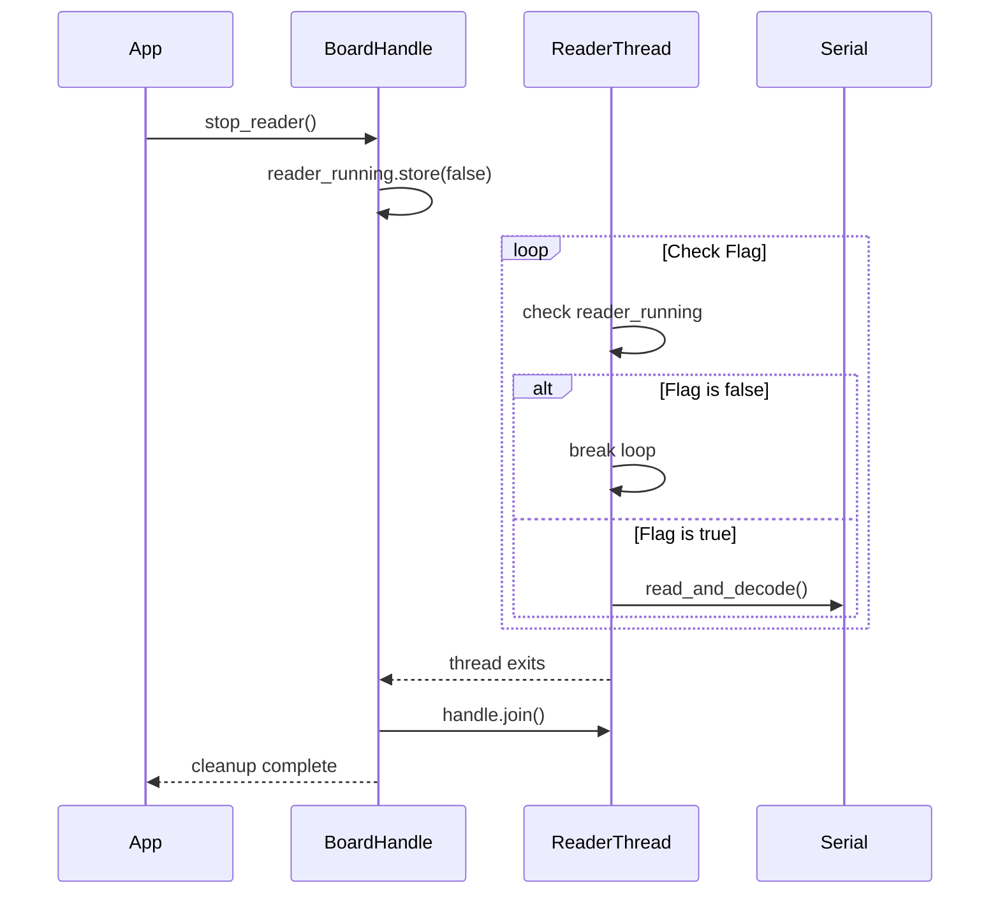
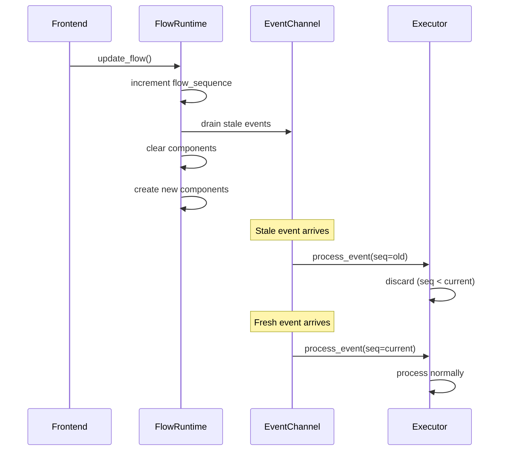

# Design Document: Rust Runtime Stability (Phase 1)

## Overview

This design addresses four critical stability issues in the Tauri/Rust runtime for Microflow:

1. **Reader Thread Lifecycle** - The reader thread that processes Firmata messages doesn't join cleanly, causing resource leaks
2. **Unified Error Types** - Error handling uses ad-hoc strings instead of structured types
3. **Async Mutex Migration** - Blocking mutex calls in async handlers can cause deadlocks
4. **Pin Race Condition** - Stale pin events can arrive after flow updates, causing ghost interactions

The implementation follows Rust best practices: proper thread lifecycle management, thiserror for error derivation, tokio::sync::Mutex for async contexts, and sequence numbers for event ordering.

## Architecture

```mermaid
graph TB
    subgraph "Current Architecture Issues"
        RT[Reader Thread] -->|drop without join| LEAK[Resource Leak]
        CMD[Async Commands] -->|blocking .lock| BLOCK[Potential Deadlock]
        ERR[Error Handling] -->|String errors| NOCONTEXT[No Context]
        PIN[Pin Events] -->|no versioning| STALE[Stale Events]
    end

    subgraph "Improved Architecture"
        RT2[Reader Thread] -->|join on stop| CLEAN[Clean Shutdown]
        CMD2[Async Commands] -->|.lock().await| NONBLOCK[Non-blocking]
        ERR2[RuntimeError] -->|thiserror| CONTEXT[Rich Context]
        PIN2[Pin Events] -->|sequence numbers| FRESH[Fresh Events Only]
    end
```

### Thread Lifecycle Flow



### Event Sequence Flow



## Components and Interfaces

### 1. Error Module (`src/error.rs`)

New module providing unified error types for the entire runtime.

```rust
use thiserror::Error;

/// Top-level runtime error type
#[derive(Error, Debug)]
pub enum RuntimeError {
    #[error("Board not connected")]
    BoardNotConnected,
    
    #[error("Component '{0}' not found")]
    ComponentNotFound(String),
    
    #[error("Invalid pin configuration: {0}")]
    InvalidPin(String),
    
    #[error("Hardware error: {0}")]
    Hardware(#[from] HardwareError),
    
    #[error("MQTT error: {0}")]
    Mqtt(#[from] MqttError),
    
    #[error("Serialization error: {0}")]
    Serialization(#[from] serde_json::Error),
    
    #[error("Lock poisoned: {0}")]
    LockPoisoned(String),
}

/// Hardware-specific errors with context
#[derive(Error, Debug)]
pub enum HardwareError {
    #[error("Failed to open port '{port}': {reason}")]
    PortOpen { port: String, reason: String },
    
    #[error("Firmata communication failed: {0}")]
    FirmataCommunication(String),
    
    #[error("Pin {pin} does not support mode {mode}")]
    UnsupportedPinMode { pin: u8, mode: u8 },
}

/// MQTT-specific errors
#[derive(Error, Debug)]
pub enum MqttError {
    #[error("Broker '{0}' not connected")]
    NotConnected(String),
    
    #[error("Connection failed: {0}")]
    ConnectionFailed(String),
    
    #[error("Subscribe failed for topic '{topic}': {reason}")]
    SubscribeFailed { topic: String, reason: String },
}

impl RuntimeError {
    /// Convert to a frontend-friendly error message
    pub fn to_frontend_message(&self) -> String {
        self.to_string()
    }
}
```

### 2. BoardHandle Improvements (`src/runtime/base.rs`)

Updated thread lifecycle with proper join semantics.

```rust
impl BoardHandle {
    /// Stop the reader thread with proper cleanup
    pub fn stop_reader(&self) {
        // Signal thread to stop
        self.reader_running.store(false, Ordering::SeqCst);
        
        if let Some(handle) = self.reader_handle.lock().unwrap().take() {
            // Join the thread - wait for clean exit
            match handle.join() {
                Ok(_) => log::info!("Reader thread stopped cleanly"),
                Err(_) => log::warn!("Reader thread panicked during shutdown"),
            }
        }
    }
}
```

Reader thread loop with improved flag checking:

```rust
// In start_reader()
let thread_handle = std::thread::spawn(move || {
    log::info!("Firmata reader thread started");
    
    while handle_clone.reader_running.load(Ordering::SeqCst) {
        let result = handle_clone.with_board(|conn| {
            match conn.board.read_and_decode() {
                Ok(_) => {
                    conn.detect_and_emit_changes();
                    Ok(true)
                }
                Err(e) => {
                    let err_str = format!("{}", e);
                    if err_str.contains("timed out") || err_str.contains("timeout") {
                        Ok(false) // Timeout is normal
                    } else {
                        Err(format!("Read error: {}", e))
                    }
                }
            }
        });
        
        match result {
            Ok(true) => continue,
            Ok(false) => {
                // Check flag again before sleeping
                if !handle_clone.reader_running.load(Ordering::SeqCst) {
                    break;
                }
                std::thread::sleep(Duration::from_millis(1));
            }
            Err(e) => {
                if e == "Board not connected" {
                    log::info!("Firmata reader: board disconnected, stopping");
                    break;
                }
                log::warn!("Firmata reader error: {}", e);
                std::thread::sleep(Duration::from_millis(10));
            }
        }
    }
    
    log::info!("Firmata reader thread stopped");
});
```

### 3. AppState with Async Mutex (`src/lib.rs`)

```rust
use tokio::sync::Mutex as TokioMutex;

pub struct AppState {
    pub hardware_service: Arc<Mutex<HardwareService>>,
    pub flow_runtime: Arc<TokioMutex<FlowRuntime>>,  // Changed from std::sync::Mutex
    pub pending_flow: Arc<RwLock<Option<FlowUpdate>>>,
    pub board_connected: Arc<RwLock<bool>>,
    pub mqtt_manager: MqttManager,
    pub mqtt_publish_tx: mpsc::UnboundedSender<MqttPublishRequest>,
}
```

### 4. Async Command Handlers (`src/runtime/commands.rs`)

```rust
#[tauri::command]
pub async fn flow_update(
    app: tauri::AppHandle,
    flow: FlowUpdate,
    brokers: Option<Vec<FrontendBrokerConfig>>,
    state: tauri::State<'_, AppState>,
) -> Result<(), String> {
    // ... broker setup ...
    
    // Async lock acquisition
    let mut runtime = state.flow_runtime.lock().await;
    runtime.update_flow(flow)?;
    
    // ... rest of handler ...
    Ok(())
}

#[tauri::command]
pub async fn component_call(
    component_id: String,
    method: String,
    args: serde_json::Value,
    state: tauri::State<'_, AppState>,
) -> Result<(), String> {
    let value = /* convert args */;
    
    let mut runtime = state.flow_runtime.lock().await;
    runtime.call_component(&component_id, &method, value)
}
```

### 5. Sequence-Based Event Filtering (`src/runtime/mod.rs`)

```rust
use std::sync::atomic::{AtomicU64, Ordering};

pub struct FlowRuntime {
    // ... existing fields ...
    flow_sequence: AtomicU64,
    current_sequence: u64,
}

impl FlowRuntime {
    pub fn update_flow(&mut self, update: FlowUpdate) -> Result<(), String> {
        // Increment sequence FIRST
        let new_sequence = self.flow_sequence.fetch_add(1, Ordering::SeqCst) + 1;
        self.current_sequence = new_sequence;
        
        // Drain event channel to discard stale events
        if let Some(rx) = &mut self.event_rx {
            while rx.try_recv().is_ok() {
                log::debug!("Discarded stale event during flow update");
            }
        }
        
        // ... rest of update logic ...
        Ok(())
    }
}
```

Updated ComponentEvent with sequence:

```rust
#[derive(Debug, Clone, Serialize, Deserialize)]
#[serde(rename_all = "camelCase")]
pub struct ComponentEvent {
    pub source: String,
    pub source_handle: String,
    pub value: ComponentValue,
    #[serde(skip_serializing_if = "Option::is_none")]
    pub edge_id: Option<String>,
    #[serde(default)]
    pub sequence: u64,  // Flow version when event was created
}
```

## Data Models

### RuntimeError Enum

| Variant | Fields | Description |
|---------|--------|-------------|
| BoardNotConnected | - | No Firmata board is connected |
| ComponentNotFound | String (component_id) | Referenced component doesn't exist |
| InvalidPin | String (details) | Pin configuration is invalid |
| Hardware | HardwareError | Hardware-level failure |
| Mqtt | MqttError | MQTT operation failure |
| Serialization | serde_json::Error | JSON serialization failure |
| LockPoisoned | String (lock_name) | Mutex was poisoned |

### HardwareError Enum

| Variant | Fields | Description |
|---------|--------|-------------|
| PortOpen | port: String, reason: String | Failed to open serial port |
| FirmataCommunication | String (message) | Firmata protocol error |
| UnsupportedPinMode | pin: u8, mode: u8 | Pin doesn't support requested mode |

### ComponentEvent (Updated)

| Field | Type | Description |
|-------|------|-------------|
| source | String | Component ID that emitted the event |
| source_handle | String | Output handle name |
| value | ComponentValue | Event payload |
| edge_id | Option<String> | Edge that routed this event |
| sequence | u64 | Flow version when event was created |

### FlowRuntime State

| Field | Type | Description |
|-------|------|-------------|
| flow_sequence | AtomicU64 | Monotonically increasing flow version |
| current_sequence | u64 | Current flow version for event filtering |


## Correctness Properties

*A property is a characteristic or behavior that should hold true across all valid executions of a system—essentially, a formal statement about what the system should do. Properties serve as the bridge between human-readable specifications and machine-verifiable correctness guarantees.*

### Property 1: Thread Stop Responsiveness

*For any* BoardHandle with a running reader thread, when stop_reader() is called, the thread SHALL exit within a bounded time (e.g., 500ms) regardless of serial port state.

**Validates: Requirements 1.1, 1.4, 1.5, 1.6**

### Property 2: Error Types Implement std::error::Error

*For any* RuntimeError or HardwareError variant, the error SHALL implement both std::error::Error and std::fmt::Display traits, producing a non-empty error message.

**Validates: Requirements 2.1**

### Property 3: Error Messages Contain Context

*For any* error constructed with context parameters (component ID, pin number, port name, etc.), the resulting error message string SHALL contain all provided context values.

**Validates: Requirements 2.4, 2.5, 2.6, 2.7**

### Property 4: Flow Sequence Monotonic Increment

*For any* sequence of N calls to update_flow(), the flow_sequence counter SHALL equal N after all updates complete, and each update SHALL see a strictly greater sequence than the previous.

**Validates: Requirements 4.2, 4.3**

### Property 5: Event Channel Draining

*For any* FlowRuntime with pending events in the channel, when update_flow() is called, all events queued before the call SHALL be discarded (channel is empty of pre-update events).

**Validates: Requirements 4.4**

### Property 6: Stale Event Filtering

*For any* ComponentEvent with sequence S and FlowRuntime with current_sequence C where S < C, the event SHALL be discarded without processing (not routed to any component).

**Validates: Requirements 4.5**

## Error Handling

### Error Propagation Strategy

1. **Internal errors** use `RuntimeError` and its sub-types
2. **Tauri command errors** convert `RuntimeError` to `String` for frontend consumption
3. **Logging** captures full error context before conversion

### Error Conversion for Frontend

```rust
impl From<RuntimeError> for String {
    fn from(err: RuntimeError) -> String {
        err.to_string()
    }
}
```

### Lock Error Handling

For `std::sync::Mutex` (used in non-async contexts like hardware_service):

```rust
fn try_with_lock<T, F, R>(lock: &Mutex<T>, name: &str, f: F) -> Result<R, RuntimeError>
where
    F: FnOnce(&mut T) -> Result<R, RuntimeError>,
{
    match lock.lock() {
        Ok(mut guard) => f(&mut guard),
        Err(_) => Err(RuntimeError::LockPoisoned(name.to_string())),
    }
}
```

For `tokio::sync::Mutex` (used in async contexts):
- No poisoning possible - lock is always acquired or task is cancelled
- Use `.lock().await` directly

### Thread Panic Handling

Reader thread panics are caught by `join()` and logged:

```rust
match handle.join() {
    Ok(_) => log::info!("Reader thread stopped cleanly"),
    Err(panic_info) => {
        log::warn!("Reader thread panicked: {:?}", panic_info);
        // Continue cleanup - don't propagate panic
    }
}
```

## Testing Strategy

### Unit Tests

Unit tests verify specific examples and edge cases:

1. **Error type construction** - Each error variant can be constructed and displays correctly
2. **Error context extraction** - Error messages contain expected context strings
3. **Sequence counter behavior** - Counter starts at 0, increments correctly
4. **Event filtering logic** - Events with old sequences are rejected

### Property-Based Tests

Property tests use the `proptest` crate to verify universal properties across generated inputs.

**Configuration:**
- Minimum 100 iterations per property test
- Use `proptest` crate for Rust property-based testing

**Test Tags:**
Each property test includes a comment referencing the design property:
```rust
// Feature: rust-runtime-stability, Property N: <property_text>
```

### Property Test Implementations

**Property 1: Thread Stop Responsiveness**
```rust
// Generate random thread states and verify stop completes within timeout
proptest! {
    #[test]
    fn thread_stops_within_timeout(delay_ms in 0u64..100) {
        // Setup thread with simulated delay
        // Call stop_reader()
        // Assert thread exits within 500ms
    }
}
```

**Property 3: Error Messages Contain Context**
```rust
proptest! {
    #[test]
    fn error_contains_component_id(id in "[a-z0-9-]{1,50}") {
        let err = RuntimeError::ComponentNotFound(id.clone());
        prop_assert!(err.to_string().contains(&id));
    }
    
    #[test]
    fn hardware_error_contains_port_and_reason(
        port in "[a-zA-Z0-9/]{1,20}",
        reason in ".{1,100}"
    ) {
        let err = HardwareError::PortOpen { 
            port: port.clone(), 
            reason: reason.clone() 
        };
        let msg = err.to_string();
        prop_assert!(msg.contains(&port));
        prop_assert!(msg.contains(&reason));
    }
}
```

**Property 4: Flow Sequence Monotonic Increment**
```rust
proptest! {
    #[test]
    fn sequence_increments_monotonically(update_count in 1usize..100) {
        let mut runtime = FlowRuntime::new();
        let mut last_seq = 0u64;
        
        for _ in 0..update_count {
            runtime.update_flow(empty_flow()).unwrap();
            let new_seq = runtime.current_sequence();
            prop_assert!(new_seq > last_seq);
            last_seq = new_seq;
        }
        
        prop_assert_eq!(last_seq, update_count as u64);
    }
}
```

**Property 6: Stale Event Filtering**
```rust
proptest! {
    #[test]
    fn stale_events_are_discarded(
        current_seq in 1u64..1000,
        event_seq in 0u64..1000
    ) {
        let mut executor = FlowExecutor::new();
        executor.set_current_sequence(current_seq);
        
        let event = ComponentEvent {
            source: "test".into(),
            source_handle: "value".into(),
            value: ComponentValue::Bool(true),
            edge_id: None,
            sequence: event_seq,
        };
        
        let was_processed = executor.process_event(event);
        
        if event_seq < current_seq {
            prop_assert!(!was_processed, "Stale event should be discarded");
        } else {
            // Fresh events may or may not be processed depending on routing
        }
    }
}
```

### Integration Tests

Integration tests verify end-to-end behavior:

1. **Connect/disconnect cycles** - No resource leaks after 10 cycles
2. **Flow update during events** - Stale events don't cause ghost interactions
3. **Concurrent command handling** - Multiple async commands don't deadlock

### Test File Organization

```
apps/web/src-tauri/
├── src/
│   ├── error.rs          # Error types with unit tests
│   └── runtime/
│       ├── mod.rs        # FlowRuntime with sequence tests
│       └── executor.rs   # Event filtering tests
└── tests/
    ├── thread_lifecycle.rs   # Property tests for thread behavior
    ├── error_context.rs      # Property tests for error messages
    └── event_sequence.rs     # Property tests for event filtering
```
