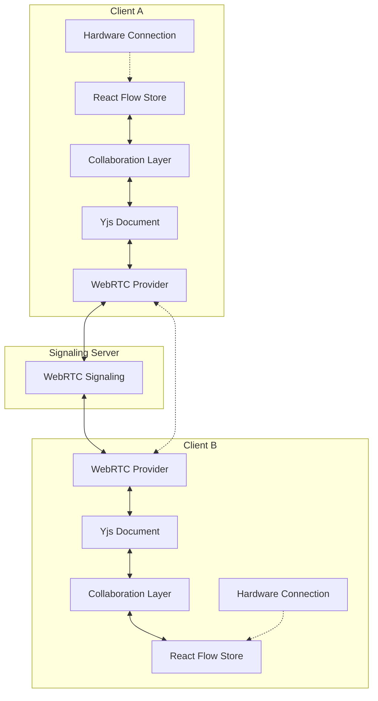

# Design Document

## Overview

The real-time collaboration system will integrate Yjs (a CRDT library) with the existing Zustand-based React Flow store to enable seamless multi-user editing. The design leverages WebRTC for peer-to-peer communication, ensuring low latency and reducing server dependencies. Each client maintains its own hardware connections while sharing the flow diagram state through a synchronized Yjs document.

## Architecture

### High-Level Architecture



### Data Flow

1. **Local Changes**: User interactions update the React Flow store
2. **Sync to Yjs**: Collaboration layer captures store changes and applies them to the Yjs document with client origin
3. **Network Propagation**: Yjs automatically syncs changes through WebRTC to other clients
4. **Remote Updates**: Other clients receive Yjs updates and apply them to their local stores
5. **Hardware Isolation**: Hardware connections remain local and don't sync across clients

## Components and Interfaces

### CollaborationManager

The main orchestrator that manages the collaboration lifecycle.

```typescript
interface CollaborationManager {
  // Lifecycle management
  initCollaboration(roomName: string): Promise<CollaborationSession>
  disconnect(): void
  
  // State management
  isConnected(): boolean
  getConnectedUsers(): string[]
  
  // Event handling
  on(event: 'connected' | 'disconnected' | 'user-joined' | 'user-left', callback: Function): void
}
```

### CollaborationSession

Represents an active collaboration session with all necessary components.

```typescript
interface CollaborationSession {
  ydoc: Y.Doc
  provider: WebrtcProvider
  yNodes: Y.Array<Node>
  yEdges: Y.Array<Edge>
  undoManager: UndoManager
  localOrigin: { clientId: number }
  
  // Cleanup
  destroy(): void
}
```

### YjsStoreAdapter

Bridges the React Flow store with the Yjs document, handling bidirectional synchronization.

```typescript
interface YjsStoreAdapter {
  // Sync methods
  syncLocalToYjs(nodes: Node[], edges: Edge[]): void
  syncYjsToLocal(): void
  
  // Subscription management
  subscribeToStore(): () => void
  subscribeToYjs(): () => void
  
  // Conflict resolution
  handleConflicts(localChanges: any[], remoteChanges: any[]): void
}
```

### UndoRedoManager

Manages client-specific undo/redo operations using Yjs UndoManager.

```typescript
interface UndoRedoManager {
  undo(): boolean
  redo(): boolean
  canUndo(): boolean
  canRedo(): boolean
  
  // Stack management
  clear(): void
  getStackSize(): { undoStack: number, redoStack: number }
}
```

## Data Models

### Yjs Document Structure

```typescript
// Yjs document schema
interface YjsDocumentSchema {
  nodes: Y.Array<Node>     // Synchronized node array
  edges: Y.Array<Edge>     // Synchronized edge array
  metadata: Y.Map<any>     // Room metadata (optional)
}
```

### Client Origin Tracking

```typescript
interface ClientOrigin {
  clientId: number         // Unique Yjs client ID
  timestamp: number        // Creation timestamp
  sessionId: string        // Optional session identifier
}
```

### Collaboration State

```typescript
interface CollaborationState {
  isEnabled: boolean
  roomName: string | null
  connectedUsers: string[]
  connectionStatus: 'disconnected' | 'connecting' | 'connected' | 'error'
  lastSyncTime: number
}
```

## Error Handling

### Connection Failures

- **WebRTC Connection Loss**: Implement automatic reconnection with exponential backoff
- **Signaling Server Unavailable**: Show user-friendly error message and retry mechanism
- **Peer Discovery Timeout**: Graceful fallback to local-only mode

### Synchronization Conflicts

- **Concurrent Modifications**: Yjs CRDT automatically resolves conflicts
- **Large State Differences**: Implement incremental sync for large documents
- **Network Partitions**: Handle split-brain scenarios with eventual consistency

### Data Integrity

- **Malformed Updates**: Validate Yjs updates before applying to local store
- **Schema Mismatches**: Version compatibility checks for different client versions
- **Corrupted State**: Implement state recovery mechanisms

## Testing Strategy

### Unit Tests

1. **YjsStoreAdapter Tests**
   - Bidirectional synchronization accuracy
   - Subscription lifecycle management
   - Conflict resolution scenarios

2. **UndoRedoManager Tests**
   - Client-specific undo/redo operations
   - Origin tracking accuracy
   - Stack management edge cases

3. **CollaborationManager Tests**
   - Session lifecycle management
   - Event emission and handling
   - Error state management

### Integration Tests

1. **Multi-Client Scenarios**
   - Two-client synchronization
   - Multiple clients joining/leaving
   - Network interruption recovery

2. **Store Integration**
   - React Flow store compatibility
   - Existing functionality preservation
   - Performance impact measurement

3. **Hardware Isolation**
   - Local hardware connection independence
   - Hardware state non-synchronization
   - Concurrent hardware testing

### End-to-End Tests

1. **Real-World Collaboration**
   - Complete user workflow simulation
   - Network condition variations
   - Long-running session stability

2. **Performance Testing**
   - Large document synchronization
   - High-frequency update handling
   - Memory usage optimization

## Implementation Phases

### Phase 1: Core Infrastructure
- Yjs document setup and WebRTC provider configuration
- Basic bidirectional synchronization between store and Yjs
- Connection management and error handling

### Phase 2: Undo/Redo System
- Client-specific undo manager implementation
- Origin tracking and isolation
- UI components for undo/redo controls

### Phase 3: Advanced Features
- User presence indicators
- Connection status UI
- Performance optimizations and conflict resolution

### Phase 4: Hardware Integration
- Ensure hardware connections remain local
- Test hardware isolation across clients
- Validate concurrent hardware usage scenarios