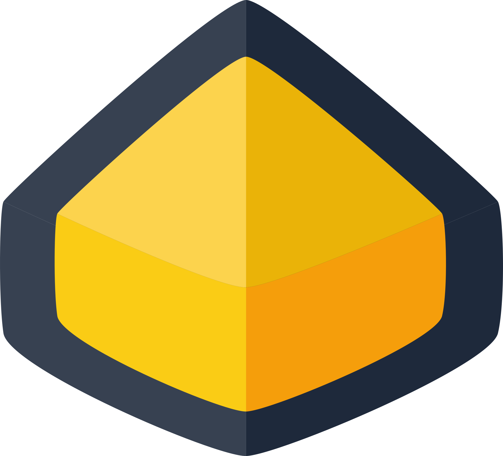
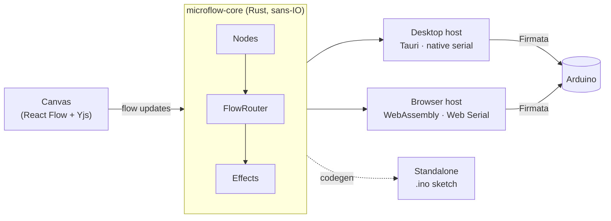

<div align="center">



# Microflow

**Make hardware interactive by drawing a flow. No code needed.**

Wire buttons, sensors, LEDs and motors together on a visual canvas, and watch your
Arduino respond right away. Microflow runs in your browser and as a desktop app.

[**Open in browser**](https://microflow.tech) ·
[**Download**](https://github.com/xiduzo/microflow/releases/latest) ·
[**Docs**](https://docs.microflow.tech) ·
[**Figma plugin**](https://www.figma.com/community/plugin/1373258770799080545)

[](https://github.com/xiduzo/microflow/releases/latest)
[](LICENSE.md)
[](https://github.com/xiduzo/microflow/actions/workflows/rust.yml)
[](https://github.com/xiduzo/microflow/actions/workflows/typescript.yml)

<a href="https://www.producthunt.com/products/microflow?embed=true&utm_source=badge-featured&utm_medium=badge&utm_campaign=badge-microflow" target="_blank" rel="noopener noreferrer"></a>

</div>

## What you can do

- **Build with blocks.** About 40 nodes, grouped into **Sense**, **Generate**,
  **Shape**, **Decide** and **Express**. Use them for buttons, potentiometers,
  motion and distance sensors, LEDs, addressable LED strips, LED matrices, servos,
  steppers, relays, piezo tones, I²C devices and NFC readers.
- **Edit while it runs.** Changes go to the board immediately. You do not compile,
  upload or restart.
- **Use it anywhere.** Open [microflow.tech](https://microflow.tech) in Chrome or
  Edge (it uses Web Serial), or install the desktop app for macOS, Windows or Linux.
  Microflow puts the firmware on your board for you.
- **Take it off the computer.** Export a flow as a standalone Arduino sketch for
  an Uno, Nano or ESP32.
- **Connect your designs.** Link the variables in a Figma file, or the design tokens
  in a Penpot file, to your flows through MQTT. A real knob can resize a shape in the
  open design, and a value you change in the design can dim a real LED. The plugins
  run in the design editor, not in prototypes.
- **Go beyond the board.** Nodes for MQTT, MIDI, LLMs, keyboard hotkeys and custom
  JavaScript functions.
- **Ask AI.** Describe what you want, and Ask AI adds and wires the nodes for you.
  Use any OpenAI-compatible provider (OpenAI, OpenRouter, Ollama, LM Studio). In the
  desktop app, you can also use Claude Code.
- **Build together.** Edit a flow with other people in real time, see their cursors,
  and share by invitation. You can also publish flows to the community and fork
  flows that other people made.

## Quick start

1. Open **[microflow.tech](https://microflow.tech)** or
   [download the desktop app](https://github.com/xiduzo/microflow/releases/latest).
2. Connect an Arduino (Uno, Nano, Mega, Leonardo or Micro) with a USB cable.
   Microflow detects the board and flashes StandardFirmata onto it.
3. Put a **Button** node and an **LED** node on the canvas and connect them.
   Press the button, and the LED turns on.

Next, follow the [first-flow tutorial](https://docs.microflow.tech/docs/learn/first-flow)
or start from one of the built-in templates.

## The Microflow family

| | What it is |
|---|---|
| **[Microflow Studio](apps/web)** | The flow editor, as a web app and a desktop app (Tauri). Start here. |
| **[Hardware Bridge for Figma](apps/figma-plugin)** | Links the variables in a Figma file's `MHB` collection to your flows through MQTT. Available in the [Figma Community](https://www.figma.com/community/plugin/1373258770799080545). |
| **[Microflow for Penpot](apps/penpot-plugin)** | Links the tokens in a Penpot file's `MHB` token set to your flows. Same protocol as the Figma plugin. Not in Penpot's plugin directory yet; run it from source. |
| **[Docs](apps/fumadocs)** | Tutorials, how-to guides, a reference for each node and troubleshooting, at [docs.microflow.tech](https://docs.microflow.tech). |

## How it works

The flow runtime is written once, in Rust, and it does no I/O itself
(it is "sans-IO"). The desktop app runs it natively. The browser runs the same
code compiled to WebAssembly. Each host only does the I/O (serial port, timers,
network), so a flow behaves the same on both platforms.



To learn more, read [`ARCHITECTURE.md`](ARCHITECTURE.md) (a five-minute map),
[`CONTEXT.md`](CONTEXT.md) (the domain language) and [`docs/adr/`](docs/adr/)
(the reason behind each design decision).

**Built with** Rust · WebAssembly · Tauri 2 · React · React Flow · TanStack Router/Query ·
Tailwind CSS v4 · Yjs · tRPC · Hono · Better Auth · Drizzle (PostgreSQL) · MQTT ·
Bun · Turborepo.

## Development

### Prerequisites

- [Bun](https://bun.sh) ≥ 1.3.5
- [Rust](https://rustup.rs) (stable) and the [Tauri prerequisites](https://tauri.app/start/prerequisites/) for your OS
- [Docker](https://www.docker.com), for the local PostgreSQL database

### Setup

```bash
git clone https://github.com/xiduzo/microflow.git
cd microflow
bun install

bun db:start     # start PostgreSQL in Docker
bun db:push      # apply the schema

bun dev          # run all apps
```

To run one app only, use `bun dev:web` (Studio in the browser), `bun dev:native`
(the desktop shell) or `bun dev:server` (the API and collaboration server).

To work on the Figma plugin, run `bun run dev` in `apps/figma-plugin`. It rebuilds on every
change. Then, in the Figma desktop app, go to **Plugins → Development → Import plugin from
manifest** and select `apps/figma-plugin/manifest.json`.

To work on the Penpot plugin, run `bun run dev` in `apps/penpot-plugin`. Then, in Penpot,
open the plugin manager and install `http://localhost:5173/manifest.json`. `bun run build`
writes a `dist/` folder that you can host under any path, as long as the server sends CORS
headers.

Both plugins share their protocol and bridge engine through `packages/design-bridge`.

### Repository layout

```
apps/
├── web/            Studio: React UI (src/) + Tauri desktop shell (src-tauri/)
├── server/         Hono + tRPC API and the Yjs collaboration server
├── figma-plugin/   Microflow Hardware Bridge for Figma
├── penpot-plugin/  Microflow for Penpot
└── fumadocs/       Documentation site (Next.js + Fumadocs)
crates/
├── microflow-core/          The flow runtime and Arduino code generation
├── microflow-runtime-wasm/  The runtime compiled to WebAssembly
├── microflow-firmata-wasm/  Firmata for the browser
└── microflow-codegen-wasm/  Sketch generation for the browser
packages/
└── api · auth · collab · db · design-bridge · env · mqtt · config
```

<details>
<summary><strong>All scripts</strong></summary>

| Script | Description |
|---|---|
| `bun dev` | Start all apps in dev mode |
| `bun dev:web` | Start Studio in the browser |
| `bun dev:native` | Start the Tauri desktop shell |
| `bun dev:server` | Start the API and collaboration server |
| `bun build` | Build all apps |
| `bun check-types` | Type-check the whole monorepo |
| `bun check` | Lint and format with Oxlint and Oxfmt |
| `bun bench` | Run the benchmarks ([`docs/benchmarks.md`](docs/benchmarks.md)) |
| `bun db:start` / `db:stop` | Start or stop PostgreSQL in Docker |
| `bun db:push` | Push schema changes |
| `bun db:generate` / `db:migrate` | Generate or run migrations |
| `bun db:studio` | Open Drizzle Studio |

Tests: `bun test` in `apps/web` for TypeScript, and `cargo test` for Rust.

</details>

## Contributing

Contributions are welcome. You can report a bug, improve the docs or add a new node.

- [Ways to help](https://docs.microflow.tech/docs/contributing/ways-to-help)
- [Build from source](https://docs.microflow.tech/docs/contributing/build-from-source)
- [Add a node](https://docs.microflow.tech/docs/contributing/adding-a-node)
- [Report a bug or request a feature](https://github.com/xiduzo/microflow/issues)

For security issues, see [`SECURITY.md`](SECURITY.md).

## Support

Microflow is free and open source. If it helps you, you can support its development
through [GitHub Sponsors](https://github.com/sponsors/xiduzo) or
[Polar](https://polar.sh/microflow).

## License

[GPL-3.0](LICENSE.md)
