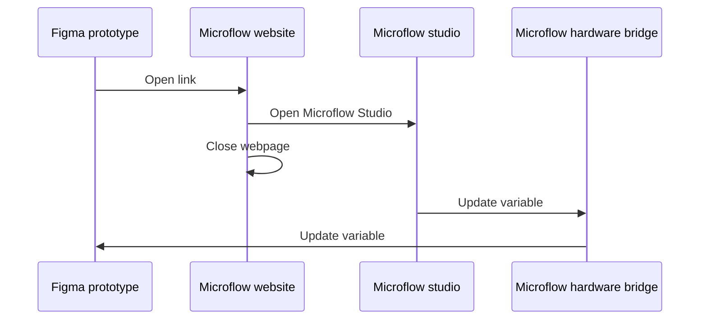

There are three ways to exchange data between your hardware and Figma variables.

---

## 1. Hardware → Figma (publishing updates)

When your hardware sends a value update via Microflow Studio, the corresponding Figma variable updates instantly. This affects:

- The variable value in Figma's variable panel
- Any designs that use that variable
- Any prototypes actively using that variable

**Example:** A light sensor reads 750. Microflow Studio publishes that value. A Figma variable called `brightness` updates to 750, and any design element tied to that variable reflects the change.

<Callout type="info" title="This happens automatically">
You do not need to set up or know about MQTT topics to use this feature. Microflow Studio and the Hardware Bridge handle all the messaging for you behind the scenes. The details below are for advanced users who want to integrate other tools.
</Callout>

<details>
<summary>Advanced: MQTT topic format</summary>

MQTT routes messages using "topics" — structured strings that act like addresses. Each variable has its own unique topic, based on your settings and the variable's ID in Figma.

**Example publishing topic:**
```
microflow/v1/xiduzo/YOUR_APP_NAME/variable/VariableID:1:25/set
```

| Segment | Meaning |
| --- | --- |
| `microflow/v1` | Base topic for the Hardware Bridge |
| `xiduzo` | Your configured [identifier](/docs/microflow-hardware-bridge/variables#mqtt-settings) |
| `YOUR_APP_NAME` | A name for your client — any string without spaces (e.g. `my-app`) |
| `variable` | Message type: a variable update |
| `VariableID:1:25` | The Figma variable ID (in this case, `1:25`) |
| `set` | The action to perform |

</details>

---

## 2. Figma → Hardware (subscribing to updates)

When you change a variable value in Figma's variable panel, the Hardware Bridge automatically publishes that change over MQTT. Any hardware that is subscribed to that variable's topic will receive the update.

**Example:** You change a color variable in Figma. Your hardware receives the new color value and updates an RGB LED.

<Callout type="info" title="This happens automatically">
You do not need to configure anything for this direction. When you change a variable in Figma's variable panel, the Hardware Bridge automatically sends the update to your hardware.
</Callout>

<details>
<summary>Advanced: MQTT subscribing topic format</summary>

**Example subscribing topic:**
```
microflow/v1/xiduzo/plugin/variable/VariableID:1:25
```

| Segment | Meaning |
| --- | --- |
| `microflow/v1` | Base topic for the Hardware Bridge |
| `xiduzo` | Your configured identifier |
| `plugin` | Identifies this message as coming from the Figma plugin |
| `variable` | Message type: a variable update |
| `VariableID:1:25` | The Figma variable ID |

</details>

---

## 3. Updating variables from a running prototype

<Callout type="warn" title="Help us make this simpler">
We think this flow is more complicated than it needs to be, and ideally Figma would support this natively.

If you agree, please upvote or comment on [this Figma forum post](https://forum.figma.com/ask-the-community-7/communicating-between-prototype-and-figma-plugin-13868) to show Figma there is demand for it.
</Callout>

Updating a variable from within a running Figma prototype (e.g. when a user clicks something in the prototype) is not straightforward, because Figma does not allow plugins to directly receive events from prototypes.

**The workaround:** The prototype opens a small webpage, which then opens Microflow Studio on your computer to trigger the variable update.

### Requirements

- Microflow Studio must be installed and running
- The Microflow Hardware Bridge plugin must be open in Figma
- The prototype should be running (ideally in a browser, not inside Figma)

### How to set it up

1. In your Figma prototype, add an interaction to a frame (for example: "On click")
2. Set the action to **Open link**
3. Use a link in this format:

```
https://microflow.vercel.app/set/VariableID:1:25/YOUR_VALUE
```

Replace `VariableID:1:25` with your actual variable ID (find it in Figma's variable panel), and `YOUR_VALUE` with the value you want to set.

### Supported value formats

| Variable type | Example values |
| --- | --- |
| Number | `123` or `12.3` |
| String | `Hello` or `"Hello, World!"` |
| Boolean | `true` or `false` |
| Color | ⚠ Not implemented yet |

<Callout type="info" title="Image placeholder">
  Screenshot showing how to set the "Open link" action on a Figma prototype interaction.
</Callout>

### What happens step by step

1. A user interacts with the prototype (e.g. clicks a button)
2. The prototype opens a webpage in a new window
3. The webpage triggers Microflow Studio to open on your computer
4. The webpage closes itself
5. Microflow Studio sends the update to the Figma plugin via MQTT
6. The Figma variable updates, and your hardware receives the change



### Known issues

**The webpage does not open Microflow Studio correctly.**

You can test whether the deep link is working on your machine by [clicking here](microflow-studio://link-web). If Microflow Studio opens, everything is configured correctly.
