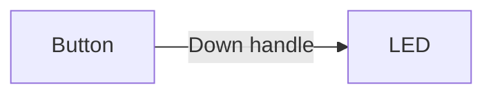
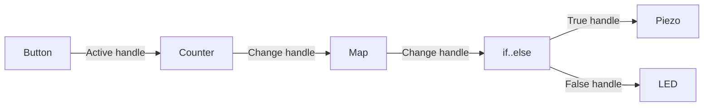

Edges are the lines that connect [nodes](/docs/microflow-studio/nodes) together. They carry information and signals from one node to the next, creating a flow of data and actions through your project.

**To draw an edge:** click and drag from the output handle (the green dot on the right side of a node) to the input handle (the blue dot on the left side of another node). A line appears — that is your edge.

**To delete an edge:** click on the edge to select it, then press the Delete or Backspace key.

<Callout type="info" title="Video placeholder">
  Walkthrough video (2–3 min): Show how to build a simple flow from scratch — right-click to add a Button node, right-click to add an LED node, draw an edge connecting them, and then show the LED responding when the button is pressed on the Arduino. Highlight the green and blue dots clearly so viewers know exactly where to click.
</Callout>

<Callout title="What are pins?">
Pins are the numbered connection points on your Arduino board. They are the physical spots where you plug in components like buttons, LEDs, and sensors. For example, "pin 6" means the hole or leg labeled 6 on your board.

**Pin 13** is special — it connects to a tiny built-in LED already on the board, which is handy for testing.
</Callout>

---

## Examples

### Simple flow

This is a basic two-node flow: pressing a button turns on an LED.

- Button is connected to **pin 6**
- LED is connected to **pin 13** (the built-in one)
- When the button is pressed, the signal travels along the edge and the LED turns on

[Download this example](/flow-examples/simple_flow.microflow)

---

### Complex flow

This example adds more nodes to create a small interaction:

1. Pressing a button increments a Counter
2. The Counter's value gets converted by a Map node (e.g. from 0–10 into 0–255)
3. A Compare node checks whether the mapped value crosses a threshold
4. If **true** → a Piezo buzzer plays a sound
5. If **false** → an LED lights up

[Download this example](/flow-examples/complex_flow.microflow)
