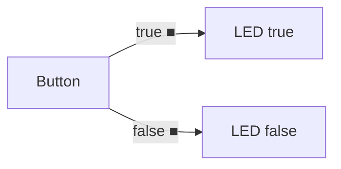
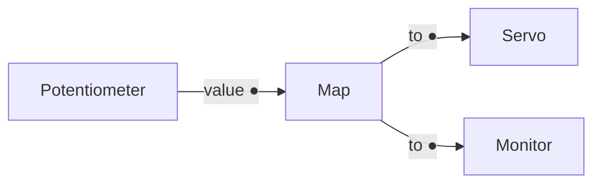
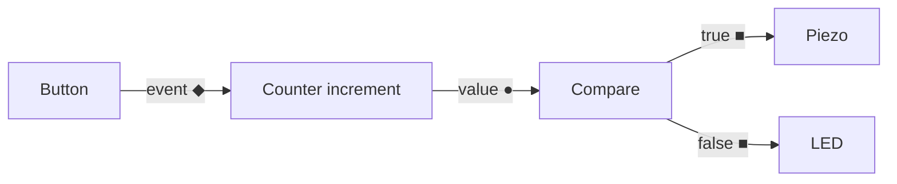

An edge runs from one node's output handle to another node's input handle. Outputs sit on the right of a node. Inputs sit on the left.

- **Draw an edge** — drag from an output handle to an input handle. Press `Cmd/Ctrl + =` to zoom in first if the handles are hard to hit.
- **Delete an edge** — click it, then press Delete or Backspace.

<Video title="Your first flow" duration="3:30" script="/docs/videos/first-flow">
Drawing an edge from an output handle to an input handle, zoomed in far enough to see them.
</Video>

## Handle shapes

Studio draws every handle as one of four symbols. The symbol tells you what the handle carries.

| Symbol | Kind | Carries |
| --- | --- | --- |
| ● | **Value** | A number, a colour, or text that updates continuously. |
| ◆ | **Event** | A moment. It fires once and is gone. |
| ■ | **State** | A condition that is true or false right now. |
| ▶ | **Command** | An instruction: turn on, reset, play, send. |

The useful pairings follow from that:

- **Event → Command.** Something happened, so do something. Interval `event` → LED `toggle`.
- **State → State.** Mirror a condition. Button `true` → LED `true`, and `false` → `false` so the LED switches off again.
- **Value → Value.** Pass a number along a chain, usually through a [Map](/docs/microflow-studio/nodes/shape/map) or [Smooth](/docs/microflow-studio/nodes/shape/smooth) node.

You can cross the kinds. A value arriving at a command input still triggers it.

## One output, many inputs

An output handle feeds as many inputs as you like. This is why you can connect a [Monitor](/docs/microflow-studio/nodes/express/monitor) node to any output without disturbing the existing edge.

## When a handle will not connect

- **The handle is disabled.** The [LED](/docs/microflow-studio/nodes/express/led) node's brightness input refuses a pin without PWM, and the handle's hint reads `requires a ~ pin`. Move the LED to pin 3, 5, 6, 9, 10, or 11 on an Uno.
- **You have the viewer role.** A **View only** badge appears in the corner. See [Collaborate on a flow](/docs/how-to/collaborate-on-a-flow).
- **You are dragging the wrong way.** Two outputs do not connect to each other.

## Examples

### Two nodes

Press a button, light an LED. Two edges, because switching off is a separate instruction.

```mermaid
flowchart LR
    A[Button] -- "true ■" --> B[LED true]
    A -- "false ■" --> C[LED false]
```

Build it in [A button controls an LED](/docs/learn/button-controls-led).

### A longer chain

A knob drives a servo. A Map node rescales the value, and a Monitor watches the middle.

```mermaid
flowchart LR
    A[Potentiometer] -- "value ●" --> B[Map]
    B -- "to ●" --> C[Servo]
    B -- "to ●" --> D[Monitor]
```

A knob reads `0`–`1023` and a servo takes `0`–`180`, so the Map node sits between them. Without it the servo reaches its limit a fifth of the way round. See [Values look wrong](/docs/troubleshooting/values-look-wrong#ranges).

### A decision

Count presses, then act differently above and below a threshold.

```mermaid
flowchart LR
    A[Button] -- "event ◆" --> B[Counter increment]
    B -- "value ●" --> C[Compare]
    C -- "true ■" --> D[Piezo]
    C -- "false ■" --> E[LED]
```

## Related

- [Nodes](/docs/microflow-studio/nodes)
- [Flows, signals, and events](/docs/concepts/flows-signals-events)
