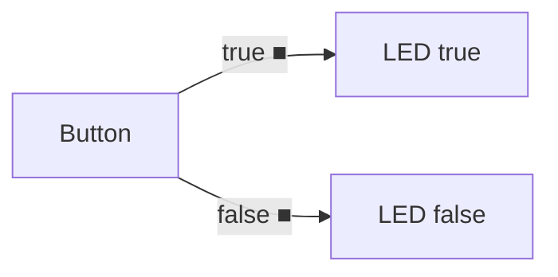
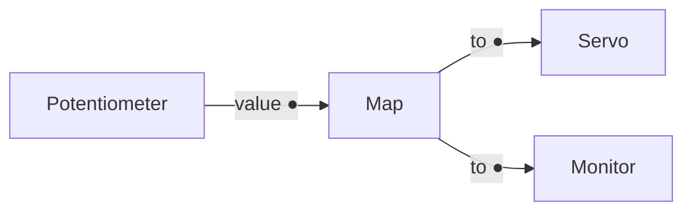
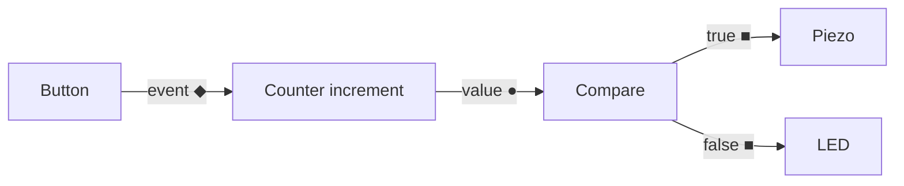

An edge is a line from one node's **output handle** to another node's **input handle**. Outputs sit on the right of a node, inputs on the left.

- **Draw one** — drag from an output handle to an input handle. Zoom in first (`Cmd/Ctrl + =`) if the handles are hard to hit.
- **Delete one** — click it, then press Delete or Backspace.

<Video title="Your first flow" duration="3:30" script="/docs/videos/first-flow">
Drawing an edge from an output handle to an input handle, zoomed in enough to see the handles.
</Video>

## Handles have shapes, and the shape is the meaning

Every handle is drawn as one of four symbols. Knowing them saves reading a reference page.

| Symbol | Kind | What it carries |
| --- | --- | --- |
| ● | **Value** | A number, a colour, or text that updates continuously. A sensor reading, a brightness, a count. |
| ◆ | **Event** | A moment. Fires and is gone — a button press, an interval tick, a delay elapsing. |
| ■ | **State** | A condition that is true or false right now. True *while* a button is held, not the moment it was pressed. |
| ▶ | **Command** | An instruction to do something. Turn on. Reset. Play. Send. |

The useful pairings follow from that:

- **Event → Command.** Something happened, so do a thing. `Interval` `event` → `LED` `toggle`.
- **State → State.** Mirror a condition. `Button` `true` → `LED` `true`, plus `false` → `false` so it turns off again.
- **Value → Value.** Pass a number along a chain, usually through a [Map](/docs/microflow-studio/nodes/shape/map) or [Smooth](/docs/microflow-studio/nodes/shape/smooth) node on the way.

Nothing stops you crossing the kinds, and sometimes you should — a value arriving at a command input still triggers it. But a flow that reads oddly usually has one of these in it.

## One output, many inputs

An output handle can feed as many inputs as you like. This is why you can hang a [Monitor](/docs/microflow-studio/nodes/express/monitor) anywhere without disturbing the flow — attach it to any output and the existing edge keeps working.

## When a handle will not connect

- **The handle is disabled.** The [LED](/docs/microflow-studio/nodes/express/led) node's brightness input refuses to connect on a pin without PWM, and the node's hint tells you: `requires a ~ pin`. Move the LED to pin 3, 5, 6, 9, 10, or 11 on an Uno.
- **You are in a flow you can only view.** A **View only** badge in the corner means you have the viewer role. See [Collaborate on a flow](/docs/how-to/collaborate-on-a-flow).
- **You are dragging the wrong way.** Output on the right, input on the left. Two outputs will not connect to each other.

## Examples

### Two nodes

Press a button, light an LED. Two edges, because turning it off is a separate instruction from turning it on.

```mermaid
flowchart LR
    A[Button] -- "true ■" --> B[LED true]
    A -- "false ■" --> C[LED false]
```

Build it in [A button controls an LED](/docs/learn/button-controls-led).

### A longer chain

A knob drives a servo, with the values rescaled on the way and a Monitor watching the middle.

```mermaid
flowchart LR
    A[Potentiometer] -- "value ●" --> B[Map]
    B -- "to ●" --> C[Servo]
    B -- "to ●" --> D[Monitor]
```

The Map node is there because a knob reads `0`–`1023` and a servo wants `0`–`180`. Without it the servo hits its limit a fifth of the way round — see [Values look wrong](/docs/troubleshooting/values-look-wrong#ranges).

### A decision

Count presses, and do one thing above a threshold and another below it.

```mermaid
flowchart LR
    A[Button] -- "event ◆" --> B[Counter increment]
    B -- "value ●" --> C[Compare]
    C -- "true ■" --> D[Piezo]
    C -- "false ■" --> E[LED]
```

## Related

- [Nodes](/docs/microflow-studio/nodes)
- [Flows, signals, and events](/docs/concepts/flows-signals-events)
