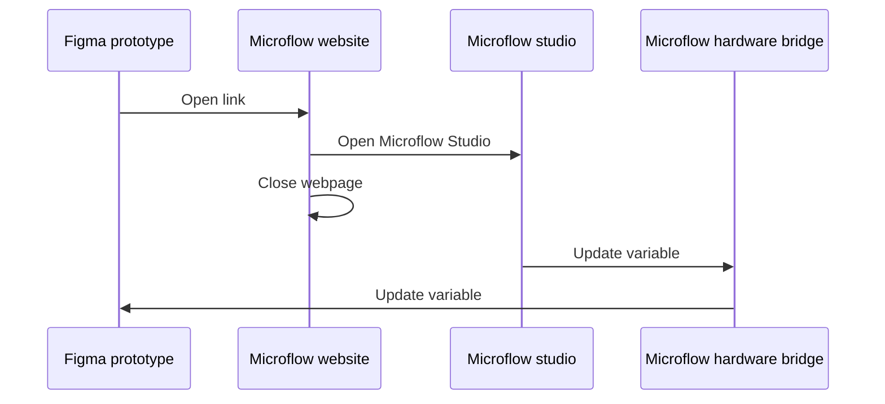

There are 3 ways to work with variables and send data between your hardware and Figma:

##  Publishing updates (Hardware → Figma)

You can send updates to Figma variables from your hardware projects using [Microflow Studio](/docs/microflow-studio). When you publish an update, it will immediately change the variable value everywhere it's used in Figma.

**What gets updated:**
- The variable value in Figma's variable panel
- All designs using that variable
- Any active prototypes that are using the variable

**Example:** If you have a light sensor reading a value, you can send that value to a Figma variable, and it will update in real-time in your Figma designs.

### Understanding MQTT topics

MQTT uses "topics" (like addresses or channels) to route messages. Each variable has a unique topic based on your settings and the variable's ID.

**Example topic:** `microflow/v1/xiduzo/YOUR_APP_NAME/variable/VariableID:1:25/set`

Here's what each part means:

| Topic level       | Description                                                                                 |
| ----------------- | ------------------------------------------------------------------------------------------- |
| `microflow/v1`    | The base topic of `Microflow hardware bridge`                                               |
| `xiduzo`          | The [configured identifier](/docs/microflow-hardware-bridge/variables#configure-mqtt)       |
| `YOUR_APP_NAME`   | The name of your app/client, any string without spaces (e.g. "myapp", "my-app" or "my_app") |
| `variable`        | The type of message, in this case a variable update                                         |
| `VariableID:1:25` | The ID of the variable in Figma, in this case `1:25`                                        |
| `set`             | The action to perform, in this case `set`                                                   |

##  Subscribing to updates (Figma → Hardware)

When you change a variable value in Figma's variable panel, the Microflow Hardware Bridge automatically sends that change to any hardware projects that are "listening" (subscribed) to that variable's MQTT topic.

**Example:** If you change a color variable in Figma, your hardware (like an RGB LED) can receive that color change and update in real-time.

### Subscribing topic

Similar to the publishing topic, the subscribing topic is unique to your broker settings and Figma variable.

An example topic could be: `microflow/v1/xiduzo/plugin/variable/VariableID:1:25`

| Topic level       | Description                                                                           |
| ----------------- | ------------------------------------------------------------------------------------- |
| `microflow/v1`    | The base topic of `Microflow hardware bridge`                                         |
| `xiduzo`          | The [configured identifier](/docs/microflow-hardware-bridge/variables#configure-mqtt) |
| `plugin`          | Identifying this message comes from the Figma plugin                                  |
| `variable`        | The type of message, in this case a variable update                                   |
| `VariableID:1:25` | The ID of the variable in Figma, in this case `1:25`                                  |

##  Updating variables from within a prototype


We think this process is more complicated than it should be and should be built into Figma by default.

If you'd like to help make this simpler, please upvote or comment on [this Figma forum post](https://forum.figma.com/ask-the-community-7/communicating-between-prototype-and-figma-plugin-13868) to show Figma that this feature is needed.


Updating variables from a running Figma prototype (like when someone clicks a button in your prototype) is a bit complicated because Figma doesn't allow plugins to directly read variable values from prototypes.

**How we solve it:** We use a workaround that opens a small webpage, which then opens Microflow Studio on your computer to update the variable. It's a few extra steps, but it works!

**Requirements to use this feature:**
- Microflow Studio must be installed on your computer and running
- The Microflow Hardware Bridge plugin must be installed in Figma and running
- Your prototype should be running (preferably in a web browser)

### How to set it up

To update a variable from your prototype, you need to add an interaction that opens a special link:

1. In your Figma prototype, add an interaction to a frame (like "on click")
2. Set the action to "Open link"
3. Paste a special link that looks like this: `https://microflow.vercel.app/set/VariableID:1:25/YOUR_VALUE`

**Understanding the link:**
- `VariableID:1:25` is the ID of the variable you want to update (you can find this in Figma)
- `YOUR_VALUE` is the new value you want to set

#### YOUR_VALUE

Different variable types required different values, see the overview below for examples.

| Variable type | Example value                  |
| ------------- | ------------------------------ |
| Number        | **123** or **12.3**            |
| String        | **"Hello, World!"** or **Foo** |
| Boolean       | **true** or **false**          |
| Color         | ⚠ not implemented yet         |

### How it works (step by step)

1. Someone interacts with your prototype (like clicking a button)
2. The prototype opens a webpage in a new window
3. The webpage automatically opens Microflow Studio on your computer (if it's installed)
4. The webpage closes itself
5. Microflow Studio sends a message to the Figma plugin to update the variable
6. The variable updates in Figma, and your hardware receives the update

### Known issues

1. The website does not open Microflow studio properly.

[>> Click here <<](microflow-studio://link-web) to validate if the link is working as expected. This should open Microflow studio when configured corretly.
