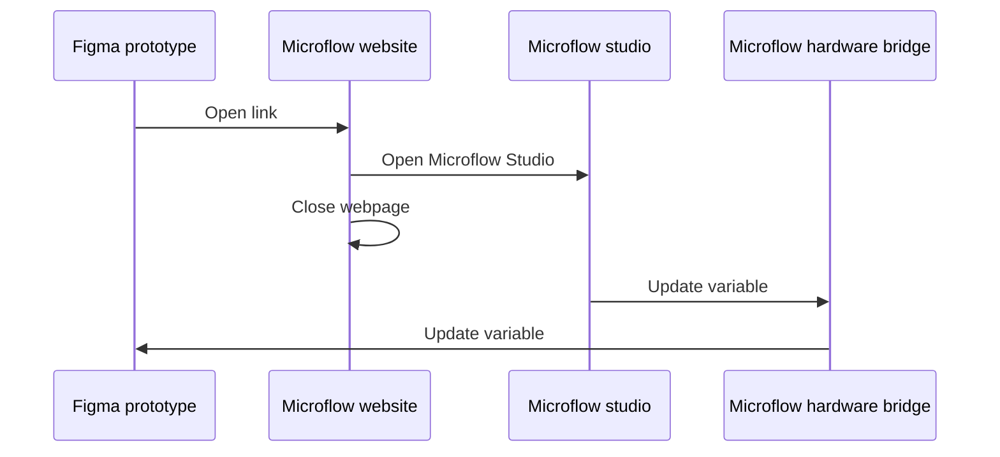

There are 3 ways to interact with variables:

##  Publishing updates

Publishing to a variable can be done from any client (like [Microflow studio](/docs/microflow-studio)) and will directly update the variable and in any place it is used in Figma.

This will update both your designs **and** any active prototypes using the variable.

### Publishing topic

The topic you will be publishing to is always unique to your broker settings and Figma variable.

For the example topic `microflow/v1/xiduzo/YOUR_APP_NAME/variable/VariableID:1:25/set`, the topic levels are as follows:

| Topic level       | Description                                                                                 |
| ----------------- | ------------------------------------------------------------------------------------------- |
| `microflow/v1`    | The base topic of `Microflow hardware bridge`                                               |
| `xiduzo`          | The [configured identifier](/docs/microflow-hardware-bridge/variables#configure-mqtt)       |
| `YOUR_APP_NAME`   | The name of your app/client, any string without spaces (e.g. "myapp", "my-app" or "my_app") |
| `variable`        | The type of message, in this case a variable update                                         |
| `VariableID:1:25` | The ID of the variable in Figma, in this case `1:25`                                        |
| `set`             | The action to perform, in this case `set`                                                   |

##  Subscribing to updates

When variables are updated via the Figma variable panel, Microflow hardware bridge will be able to pick up the changes and send them to any client listening to the MQTT topic.

### Subscribing topic

Similar to the publishing topic, the subscribing topic is unique to your broker settings and Figma variable.

An example topic could be: `microflow/v1/xiduzo/plugin/variable/VariableID:1:25`

| Topic level       | Description                                                                           |
| ----------------- | ------------------------------------------------------------------------------------- |
| `microflow/v1`    | The base topic of `Microflow hardware bridge`                                         |
| `xiduzo`          | The [configured identifier](/docs/microflow-hardware-bridge/variables#configure-mqtt) |
| `plugin`          | Identifying this message comes from the Figma plugin                                  |
| `variable`        | The type of message, in this case a variable update                                   |
| `VariableID:1:25` | The ID of the variable in Figma, in this case `1:25`                                  |

##  Updating variables from within a prototype


We also think the following interaction is cumbersome and should be part of Figma's default functionality.

If you would like to make the process simpler, by directly receiving the updates from changes in the prototype, please upvote or comment on [this Figma forum post](https://forum.figma.com/ask-the-community-7/communicating-between-prototype-and-figma-plugin-13868)


Listening to updates from within a prototype is a bit cumbersome because Figma does not allow plugins to access the values of variables from within prototypes.

To get around this limitation, and avoid needing elevated permissions like [figproxy](https://edges.ideo.com/posts/figproxy), we're utulizing a small web app that opens [Microflow Studio](/docs/microflow-studio) and updates the variable value.

In order to use this feature, you'll need to:

- have Microflow Studio installed on your computer and running.
- have the Microflow Hardware Bridge plugin installed in Figma and running.
- have a prototype running, preferably from the browser.

### What value to send?

In order to update a variable from within a prototype, you will need to add an interaction to the frame and add the `open link` action.

An example of an link to paste is `https://microflow.vercel.app/set/VariableID:1:25/YOUR_VALUE`, where `VariableID:1:25` would be the variable to update and `YOUR_VALUE` would be the value you want it to be set to.

#### YOUR_VALUE

Different variable types required different values, see the overview below for examples.

| Variable type | Example value                  |
| ------------- | ------------------------------ |
| Number        | **123** or **12.3**            |
| String        | **"Hello, World!"** or **Foo** |
| Boolean       | **true** or **false**          |
| Color         | ⚠ not implemented yet         |

### How it works

1. We create a new window that opens up our website.
2. This webpage then automatically opens the Microflow Studio app on your computer (if installed).
3. Once Microflow Studio is running, we close the webpage.
4. Microflow Studio will now request the Microflow Hardware Bridge plugin to update the variable value.

### Known issues

1. The website does not open Microflow studio properly.

[>> Click here <<](microflow-studio://link-web) to validate if the link is working as expected. This should open Microflow studio when configured corretly.
