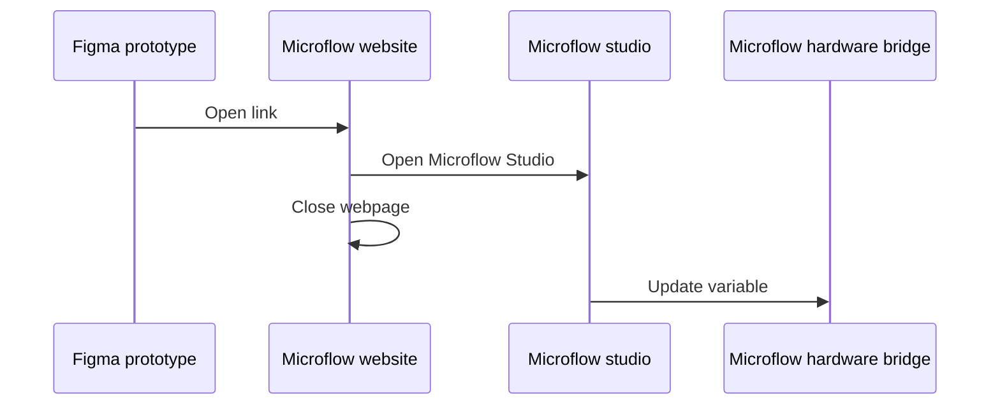

Microflow hardware bridge is using MQTT to be able to interact with your Figma variables.

In order to work with variables make sure your client is connected to the same MQTT broker as configured in the plugin. 

There are 3 ways to interact with variables:

##  Publishing updates
Publishing to a variable can be done from any client and will directly update the variable and in any place it is used in Figma.

This will update both your designs **and** any active prototypes using the variable.

##  Subscribing to updates
When variables are updated via the Figma variable panel, Microflow hardware bridge will be able to pick up the changes and send them to any client listening to the MQTT topic.

##  Updating variables from within a prototype
Listening to updates from withint a prototype is a bit cumbersome because Figma doesn't allow plugins to access the values of variables from within prototypes.

To get around this limitation and avoid needing elevated permissions like [figproxy](https://edges.ideo.com/posts/figproxy), we're utulizing a small web app that opens [Microflow Studio](/docs/microflow-studio) and updates the variable value.

In order to use this feature, you'll need to:

- have Microflow Studio installed on your computer.
- have the Microflow Hardware Bridge plugin installed and running.
- have a prototype running (preferably from the browser).

### How it works

1. We create a new window that opens up our website.
2. This webpage then automatically opens the Microflow Studio app on your computer (if installed).
3. Once Microflow Studio is running, we close the webpage.
4. Microflow Studio will now request the Microflow Hardware Bridge plugin to update the variable value.

#### Issues
Sometimes the website does not open Microflow studio properly.

[>> Click here <<](microflow-studio://link-web) to validate if the link is working as expected.
