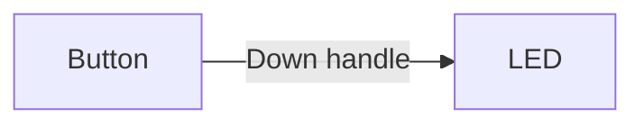
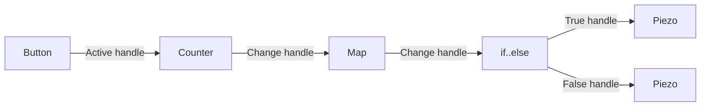

Edges allow you to connect [nodes](/docs/microflow-studio/nodes) together to create a flow of data.

Edges are created by dragging a connection from one node's handle to another node's handle.

## Examples

Flows can be simple or complex, depending on the number of nodes and the connections between them.

### Simple flow

In this example, we have a simple flow with two nodes connected by an edge. When a button (`pin 6`) is pressed, the LED (`pin 13` ([BUILTIN_LED](https://docs.arduino.cc/language-reference/en/variables/constants/ledbuiltin/))) turns on.

[Download simple flow example](/flow-examples/simple_flow.microflow)

### Complex flow

In this example, we have a more complex flow with multiple nodes connected by edges.

When a button (`pin 6`) is pressed, the counter increments. The counter value is then mapped to a range of values. **If** the counter value is greater than _N_, the LED (`pin 13` ([BUILTIN_LED](https://docs.arduino.cc/language-reference/en/variables/constants/ledbuiltin/))) turns on. **Else**, the piezo (`pin 11`) buzzer turns on.

[Download complex flow example](/flow-examples/complex_flow.microflow)
