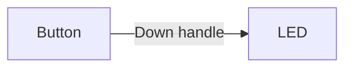
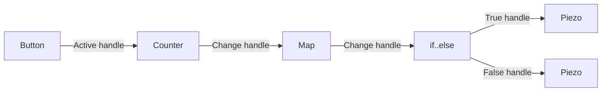

Edges are the lines that connect [nodes](/docs/microflow-studio/nodes) together. They carry information and signals from one node to another, creating a flow of data and actions.

To create an edge, simply click and drag from an output handle (on the right side of a node) to an input handle (on the left side of another node). The line that appears is the edge connecting them.

## Examples

Flows can be simple or complex, depending on the number of nodes and the connections between them.

### Simple flow

In this example, we have a simple flow with two nodes connected by an edge. When a button connected to pin 6 is pressed, the LED connected to pin 13 (the built-in LED on most Arduino boards) turns on.

**What are pins?** Pins are the numbered connection points on your microcontroller where you plug in components like buttons, LEDs, and sensors. Each pin has a number (like pin 6 or pin 13) so you know where to connect things.

[Download simple flow example](/flow-examples/simple_flow.microflow)

### Complex flow

In this example, we have a more complex flow with multiple nodes connected by edges.

Here's what happens step by step:
1. When a button connected to pin 6 is pressed, a counter node increases its count by 1
2. The counter's value is then converted (mapped) to a different range of numbers
3. A compare node checks if the mapped value is greater than a certain number (N)
4. **If** the value is greater than N, the LED on pin 13 turns on
5. **Otherwise** (else), a piezo buzzer on pin 11 makes a sound

This creates a simple game or interaction where pressing the button multiple times either lights up the LED or plays a sound, depending on how many times you've pressed it.

[Download complex flow example](/flow-examples/complex_flow.microflow)
