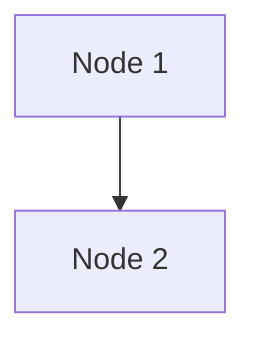
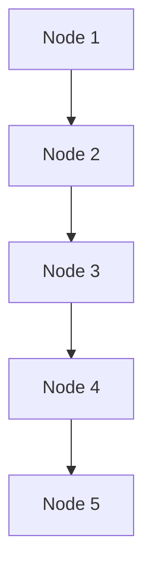

Edges allow you to connect [nodes](/docs/microflow-studio/nodes) together to create a flow of data.

Flows can be simple or complex, depending on the number of nodes and the connections between them.

## Examples

### Simple flow

In this example, we have a simple flow with two nodes connected by an edge.

### Complex flow

In this example, we have a more complex flow with multiple nodes connected by edges.

